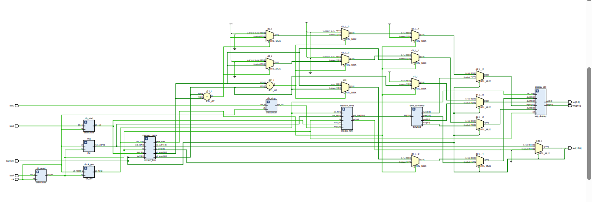

# 🕹️ FPGA Dual-Mode Gaming System

A custom, hardware-accelerated Dual-Mode Reaction Timer and Memory Game implemented purely in Verilog HDL for the Xilinx Artix-7 FPGA (Basys 3).

## 🚀 Hardware Demonstration
Watch the system in action below, demonstrating the hardware-generated random delays and 1ms precision timer:

https://github.com/AvishekDatta-KUET/FPGA-DualMode-Game/assets/media/project_demo.mp4

---

## 🛠️ Features & Architecture
* **Mode 1 (Memory Sequence):** A sequential memory game driven by a custom Finite State Machine (FSM) and an 8-bit LFSR for pseudo-random pattern generation.
* **Mode 2 (Precision Stopwatch):** A reaction timer measuring human reflex limits down to the exact millisecond, completely free of software or OS latency.
* **Hardware Debouncing:** All physical button inputs pass through custom synchronization registers to filter out mechanical button bounce.
* **Double-Dabble Algorithm:** Translates pure binary time data into BCD (Binary-Coded Decimal) in a single clock cycle to drive the multiplexed 7-segment display.

---

## 📂 Repository Structure
* `/src` - Contains all Verilog (`.v`) source code modules.
* `/constraints` - Contains the `Basys3_Master.xdc` pin mapping file.
* `/media` - Contains high-resolution project assets.

---

## 🔍 RTL Schematic
The actual logic gates and structural wiring generated by your Verilog code modules:

*Don't want to zoom in? [Click here to download the high-resolution vector PDF instead.](media/schematic.pdf)*

---
*Developed using Xilinx Vivado.*
